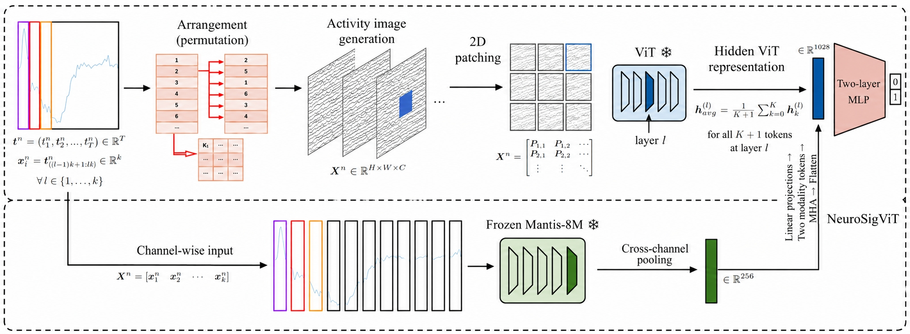

# NeuroSigViT

**NeuroSigViT** is a multimodal framework for wearable-sensor time-series
classification. It combines frozen CLIP ViT-H/14 visual representations of
sensor activity graphs with frozen Mantis-8M temporal representations, then
trains a lightweight fusion head and MLP classifier.



The maintained artifact focuses on `Shimmer_10_session10_AFC` and
`PADS_11_task08_TouchIndex`.

## Selected protocols

| Key | Dataset | Input | Split and endpoint |
| --- | --- | --- | --- |
| `shimmer10` | `Shimmer_10_session10_AFC` | `(N,6,4096)` | subject-level 69/23/25; HC versus MildPD/ModeratePD |
| `pads11` | `PADS_11_task08_TouchIndex` | `(N,6,976)` | subject-level 280/92/97 source split; Healthy versus Parkinson uses 212/70/73 after excluding OMD |

The fixed data-split seed is 42. The launcher seed, which controls model
initialization and result naming, defaults to 2022. Training-only statistics
are used whenever normalization is required. See `DATA_PROCESSING.md` for the
full protocol.

## Repository layout

```text
NeuroSigViT-main/
|-- main.py
|-- run_selector_comparison.py
|-- selector_host.py
|-- selector_policies/
|   |-- timemosaic.py
|   `-- pathformer.py
|-- experiment_common.py
|-- src/
|   |-- neurosigvit.py
|   |-- med_activity_graph.py
|   |-- medformer_graph/
|   |-- patch_mindts.py
|   |-- datautils.py
|   `-- privacy.py
|-- assets/
|   `-- neurosigvit_method.jpg
|-- data/
|   `-- wearable/
|       |-- Shimmer_10_session10_AFC/
|       `-- PADS_11_task08_TouchIndex/
|-- data_loading/
|   `-- split_reference_seed42.csv
|-- scripts/
|   |-- run_wearable_activity_graph.sh
|   |-- run_med_activity_multimodal.sh
|   |-- run_eeg_patch_mindts.sh
|   |-- run_wearable_patch_mindts.sh
|   |-- run_shimmer_example.sh
|   `-- run_pads_example.sh
|-- reproduction/
|   |-- prepare_assets.py
|   |-- evaluate_checkpoint.py
|   `-- verify_checkpoint_grid.py
|-- DATA_PROCESSING.md
|-- ANONYMITY.md
|-- requirements.txt
`-- LICENSE
```

The local dataset directories and links are runtime inputs. Datasets, model
checkpoints, feature caches, logs, results, backups, and experiment snapshots
remain on the server and are excluded from this source release.

This repository contains the scientific source and fixed configuration used by
the selector-only TimeMosaic comparison. Machine-local dataset and checkpoint
paths have been replaced by environment variables; model definitions,
hyperparameters, splits, and the selector-only protocol are preserved.

## Environment

Create an environment from the repository root:

```bash
conda create -n neurosigvit python=3.11 -y
conda activate neurosigvit
python -m pip install -r requirements.txt
```

The checked server environment uses Python 3.11, PyTorch 2.7.1, CUDA 12.6,
`open_clip_torch` 2.32.0, `mantis-tsfm` 1.0.0, and `transformers` 4.33.3.

## Checkpoints

The launchers accept frozen encoder paths through `MODEL_DIR` and `MANTIS_DIR`:

```bash
MODEL_DIR=/path/to/CLIP-ViT-H-14-laion2B-s32B-b79K
MANTIS_DIR=/path/to/Mantis-8M
```

The corresponding public models are
[`laion/CLIP-ViT-H-14-laion2B-s32B-b79K`](https://huggingface.co/laion/CLIP-ViT-H-14-laion2B-s32B-b79K)
and [`paris-noah/Mantis-8M`](https://huggingface.co/paris-noah/Mantis-8M).
Archived classifier checkpoints are optional for training. Use
`reproduction/evaluate_checkpoint.py` only when verifying an archived model;
the script creates a fresh feature cache from the selected data and encoders.

## Data sources

| Dataset | Source |
| --- | --- |
| Shimmer / PDWearML | [IEEE DataPort](https://ieee-dataport.org/documents/pdwearml-leveraging-daily-activities-rapid-free-living-parkinsons-disease-severity), [PDWearML repository](https://github.com/wang-xulong/PDWearML) |
| PADS | [PhysioNet PADS v1.0.0](https://physionet.org/content/parkinsons-disease-smartwatch/1.0.0/) |

The original licenses and access terms apply.

### PADS11 endpoint

The selected PADS experiment uses
`PADS_11_task08_TouchIndex`, the index-finger touching task from the
Parkinson's Disease Smartwatch (PADS) dataset. Each processed sample contains
six wrist inertial channels and 976 time steps. The fixed seed-42 split is
subject-disjoint and contains 280/92/97 source subjects in the
training/validation/test partitions.

For the reported binary clinical endpoint, only Healthy and Parkinson samples
are retained: `Healthy=0` and `Parkinson=1`. Other Movement Disorders (OMD)
samples are excluded without being merged into either class. This leaves
212/70/73 samples, with class counts 47/165, 15/55, and 17/56 for
Healthy/Parkinson in the three partitions. Channel normalization statistics
are fitted on the retained training samples only and then reused for validation
and test data.

Run only this endpoint with:

```bash
DRY_RUN=1 bash scripts/run_wearable_activity_graph.sh pads11
```

## Running experiments

From the repository root, first print each command without starting training:

```bash
DRY_RUN=1 bash scripts/run_wearable_activity_graph.sh shimmer10
DRY_RUN=1 bash scripts/run_wearable_activity_graph.sh pads11
```

Remove `DRY_RUN=1` only after checking GPU availability. The convenience
wrappers are equivalent:

```bash
bash scripts/run_shimmer_example.sh
bash scripts/run_pads_example.sh
```

`GPU`, `SEED`, `EPOCHS`, `PATIENCE`, `RESULT_DIR`, `FEATURE_CACHE_DIR`,
`MODEL_DIR`, `MANTIS_DIR`, `DATA_DIR`, `WEARABLE_DATA_ROOT`, and `PYTHON_BIN`
can be overridden as environment variables. Additional `main.py` arguments may
follow the dataset key.

### TimeMosaic selector-only configuration

The archived TimeMosaic experiments used `selector_only_v1_shared_v5_loss`.
This is a controlled adaptation of the hard Gumbel top-1 selector from
[TimeMosaic](https://github.com/BenchCouncil/TimeMosaic/tree/214423b7f0b4653d04620814380a9301580285cc),
not a reproduction of the complete forecasting model. Only the adaptive
granularity selector changes; Activity Graph construction, frozen CLIP and
Mantis encoders, Patch-MindTS fusion, classifier, loss, and data splits remain
shared.

| Setting | Archived value |
| --- | --- |
| Datasets | ADFTD, TDBRAIN, APAVA, Shimmer10, PADS11 |
| Seeds | 42, 43, 44 |
| Outer window / stride | 64 / 64 |
| Activity Graph candidates | `(4,)`, `(8,)`, `(16,)` |
| TimeMosaic selector | two-layer MLP, hard Gumbel top-1, temperature 0.5 |
| Fusion width / heads | 128 / 2 |
| Classifier | hidden width 128, 2 layers, dropout 0.1 |
| Optimizer | learning rate `3e-4`, weight decay `1e-3`, 100 epochs |
| Early stopping | `raw_primary`, 10-epoch warmup, patience 12, minimum delta 0.002 |
| LR scheduler | ReduceLROnPlateau, patience 4, factor 0.5, minimum LR `1e-6` |
| Batch size | ADFTD/TDBRAIN/APAVA 8; Shimmer10 1; PADS11 4 |

Set portable asset locations and launch one run from the repository root:

```bash
export NEUROSIGVIT_EEG_ROOT=/path/to/data/eeg
export NEUROSIGVIT_WEARABLE_ROOT=/path/to/data/wearable
export NEUROSIGVIT_CLIP_PATH=/path/to/CLIP-ViT-H-14-laion2B-s32B-b79K
export NEUROSIGVIT_MANTIS_PATH=/path/to/Mantis-8M

CUDA_VISIBLE_DEVICES=0 python run_selector_comparison.py \
  --method timemosaic \
  --dataset adftd \
  --seed 42 \
  --output-root results/selector_only
```

The exact runtime values are also encoded in `run_selector_comparison.py`.
`selector_host.py` installs the selected routing policy into the unchanged
`PatchMindTSFusionModule`; `selector_policies/timemosaic.py` contains the
TimeMosaic-style selector.

### Additional code paths

The source also includes MedActivity image transforms, adaptive granularity
selection, and Patch-MindTS / Router development paths. The original Shimmer
and PADS launchers above remain available.

| Entry | Purpose |
| --- | --- |
| `src/med_activity_graph.py`, `src/medformer_graph/` | MedActivity image transforms and granularity selection |
| `src/patch_mindts.py` | Patch-MindTS and Router implementation |
| `selector_policies/timemosaic.py` | TimeMosaic-style adaptive granularity selector |
| `selector_host.py` | Controlled selector replacement on the shared Patch-MindTS host |
| `run_selector_comparison.py` | Fixed five-dataset selector-only experiment configuration |
| `scripts/run_med_activity_multimodal.sh` | MedActivity multimodal launcher |
| `scripts/run_eeg_patch_mindts.sh` | EEG Patch-MindTS launcher |
| `scripts/run_wearable_patch_mindts.sh` | Shimmer / PADS Patch-MindTS launcher |

See [MedActivity implementation notes](docs/MEDACTIVITY.md) for the image and
feature layouts. The MedActivity launcher uses seed 42 by default; the original selected-dataset
launcher uses the default described above. Check each launcher's configuration
and set dataset, checkpoint, cache, and output paths for your environment.
For EEG runs, set `EEG_DATA_DIR` (default: `data/eeg/processed`);
`PYTHON_BIN` defaults to the active environment's `python`.

Run scripts from the repository root. Real experiments require the corresponding
local datasets and frozen encoders; this source update does not report new
benchmark results or establish equivalence between development and snapshot runs.

## Verification

```bash
python -m compileall -q main.py src data_loading scripts selector_policies \
  reproduction selector_host.py experiment_common.py run_selector_comparison.py
bash -n scripts/run_wearable_activity_graph.sh
bash -n scripts/run_eeg_patch_mindts.sh
bash -n scripts/run_wearable_patch_mindts.sh
```

These checks verify that the published Python sources compile and the maintained
shell launchers parse. Dataset and model behavior is verified by running the
selected experiment with the released data and frozen weights.

## Anonymous release

Follow `ANONYMITY.md`. Do not submit datasets, local links, results, feature
caches, checkpoints, logs, environment files, or Git metadata.

## License

Code is released under the terms in [LICENSE](LICENSE). Dataset use remains
subject to the original sources above.
